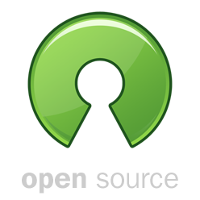
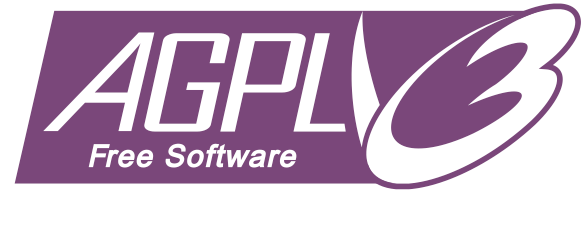
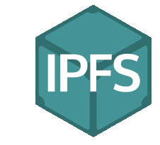
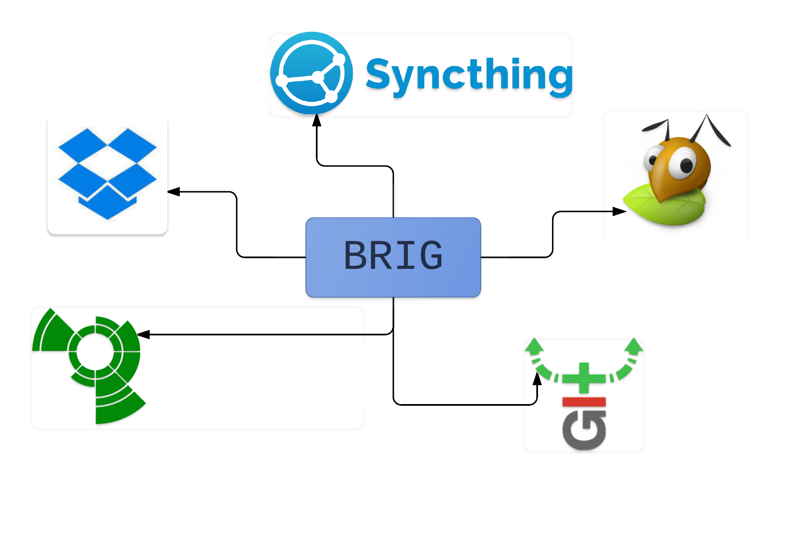
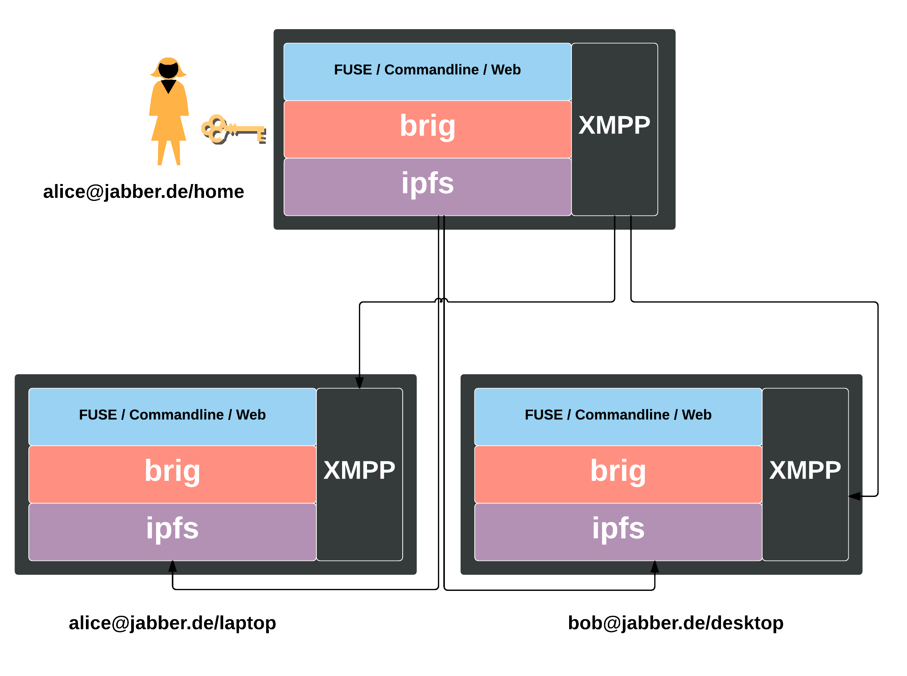

:title: Filesync
:author: Christopher Pahl, Christoph Piechula
:description: The Hovercraft! tutorial.
:keywords: presentation, backend, impress.js, hovercraft, go-lang
:css: presentation.css

----

.. utility roles

.. role:: underline
    :class: underline

.. role:: blocky
   :class: blocky

.. role:: tiny
   :class: tiny

:id: first 

:tiny:`Forschung und Entwicklung: Dezentrale & Sichere Dateisynchronisation`
``«brig»``

.. note::
   
    Brig als Name:

    1. Man operiert auf Streams. (Wie eine Brig auf dem Golfstrom)
    2. Repositories sind Datenhäfen.
    3. Sync könnte man "ship" nennen
    4. Der Besitzer eines Repo ist der Käpt'n.

----

:blocky:`Was haben wir vor`

.. note::

   Warum nicht zentral?

   Vorgehen: 
   
   - Erst Masterarbeit, evtl. mit F&E.
   - Dann Exist Gründerkredit um Weiterentwicklung zu gewährleisten.
   - Ziel: Wissenschaftliche Mitarbeiter um Forschung zu ermöglichen.

   Knoten-Typen:

   - Normaler Client
   - Archivierungsknoten
   - Backupknoten
   - ...
   
.. note::

    - Nicht verhandelbar. :-)

.. raw:: html

   

«``git`` *für große Dateien in einfach und sicher.*»

.. raw:: html

   

- Dezentrale, sichere Alternative zu Dropbox und Konsorten.
- Entwicklung eines simplen Prototypen als Masterarbeit.
- Einsatz bewährter Sicherheits-Standards.
- Open Source Software und offene Entwicklung.

**Hauptaugenmerk:**

  Datenintegrität, Sicherheit & einfache Benutzbarkeit.

.. image:: images/glenda.png
   :width: 20%
   :align: center

----

:blocky:`Vergleich`

.. ----
.. 
.. |
.. |
.. |
.. |
.. |
.. |
.. |
.. |
.. |
.. |
.. |
.. |
.. 
.. :blocky:`Dezentrales Netz`
.. 
.. .. image:: images/network.png
..    :width: 120%
..    :align: center
.. 
.. ----
.. 
.. :blocky:`Kernpunkte`
.. 
.. - Open Source Software und offene Entwicklung.
.. - Erweiterung durch Unternehmen, User und Interessenten.
.. - Entwicklung in der Programmiersprache `Go` ⇒  Portabel.
.. - ``ipfs`` als Basis ⇒ Effiziente Übertragung.
.. 
.. .. image:: images/oss.png
..    :width: 25%
..    :align: center
.. 
.. .. image:: images/glenda.png
..    :width: 25%
..    :align: center
.. 
.. .. image:: images/ipfs.png
..    :width: 25%
..    :align: center
.. 
.. .. image:: images/apgl.png
..    :width: 25%
..    :align: center
.. 

----

:blocky:`Markante Features`

.. note::

    Insgesamt "Unternehmenstauglicher" als viele andere.

    Deduplizierung: Eine Datei muss prinzipiell nur einmal im Netzwerk
    gespeichert werden.

- Verschlüsselte Übertragung *und* Speicherung.
- Kein Single-Point-of-Failure.
- Kompression & Deduplizierung (optional; mittels ``brotli``)
- Speicherquoten & Pinning (*Thin-Client vs. Storage Server*)
- Versionierung mit definierbarer Tiefe.
- Benutzerverwaltung mittels XMPP.
- 2F Authentifizierung und paranoide Sicherheit.

.. image:: images/vcs.png
   :width: 25%
   :align: center

---- 

:blocky:`Usecases`

Nutzbar als…

- …Transferlösung (Hyperlinks möglich).
- …Synchronisationslösung.
- …Backup- oder Archivierungslösung.
- …Versionsverwaltung.
- …verschlüsselten Safe.
- …als Plattform für andere Anwendungen.

:tiny:`(Oder in einer beliebigen Kombination)`

----

:blocky:`Technisch`

.. note:: 

    Wir fassen uns kurz.

---- 

:blocky:`Finanzierung`

.. note::

    Jetzt wird's schwierig.

    Zum Vergleich: Boxcryptor hat 400.000 bekommen. Für ein Jahr.

http://www.iuk-bayern.de/

- 50% der Finanzierung durch 1-2 Unternehmen.
- 50% vom Freistaat Bayern.
- Arbeitsphase auf 3 Jahre angesetzt.

.. code-block:: python

    >>> pro_mann = 12 * 3800              # =  45600€
    >>> pro_jahr = 2 * pro_mann + 25000   # = 116200€
    >>> budget = 3 * pro_jahr             # = 348600€
    
---- 

:blocky:`Monetarisierung`

.. note::

    - Zwar wissenschaftliche Mitarbeiter primär.
    - Consultants (nicht mit dem Produkt, sondern dem Drumherum)
    - 

Mögliche Einnahmequellen, durch…

- …bezahlte Entwicklung spezieller Features.
- …Supportverträge.
- …Mehrfachlizensierung.
- …Utility Bereitstellung (``LDAP``, ``yubikeys``, …)
- …zertifizierte NAS-Server.
- …Schulungen, Lehrmaterial und Consulting.
- …

---- 

:id: fin

**Fragen?**
