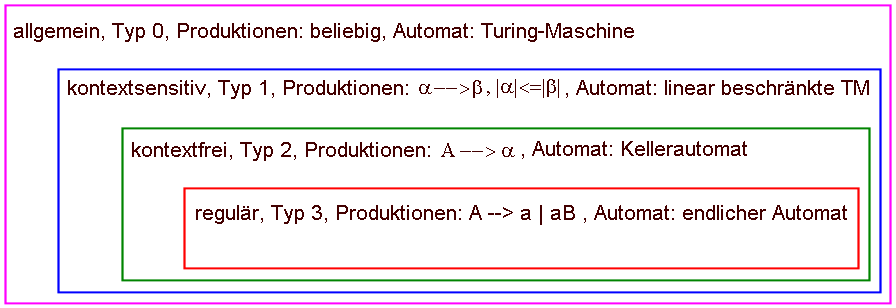

# 1. Präambel

Das folgende Skript ist eine kurze Zusammenfassung der Vorlesung Softwaresysteme
im Teilbereich Compilerbau im Sommersemester 2015.

# 2 Vorlesungsinhalte

Zu Beginn des ersten Vorlesungblocks wurde eine kurze Einführung zum Thema
Kompilieren und Linken gegeben. Der Dozent nutzte dieses Beispiel ebenfalls um
den Begriff des Compilers zu erklären und ihn mit verwandten Begriffen, wie den
des Interpreters zu verbinden.

Allgemein gesagt ist ein Compiler ein Übersetzer, der eine Eingabesprache in
eine Ausgabesprache übersetzt.  Im Speziellen sind damit oft
Compiler(-sammlungen) wie ``gcc`` oder ``clang`` gemeint, die
Programmiersprachen wie ``C`` in Maschinencode übertragen. Interpreter
übersetzen die Eingabesprache ,,live'' und führen sie dabei gleich aus. Tritt
ein Fehler auf, so stoppt auch die Übersetzung. Im besten Falle sollte der
Compiler dabei auch hilfreiche Fehlermeldungen produzieren. 

Neben der Ein- und Ausgabesprache hängt das Resultat des Compilers meist auch
von der Plattform ab auf dem er läuft. Beispielsweise produziert ``gcc`` auf der
``x86`` Architektur normal auch entsprechende Binärdateien, kann aber auch zur
*Crosskompilierung* verwendet werden, um Binärdateien für ``arm`` zu erzeugen. 

Ein wichtiges Ziel des Dozenten war stets den Studierenden ein Gefühl dafür zu
vermitteln wann ein Compiler in der Softwareentwicklung eingesetzt werden
könnte. Besonders Situationen wo Parser von Hand gebaut worden sind sollen so
vermieden werden.

Zudem fanden im Verlauf weitere Werkzeuge aus der Unix--Toolbox wie `sed`
(zeilenorientieriter kommandozeileneditor, meist zum ersetzen genutzt), `gdb `
(mächtiger debugger für C und andere Sprachen) `make` (minimales build system)
und `strace` (verfolgung von system calls eines Prozesses)  kurze Erwähnung.
Besonderen Stellenwert bekamen die eigentlichen Werkzeuge zum Compilerbau:
``lex/flex`` und ``yacc/bison``.

# 3 Sprachtheorie

Der Grundlage des Compilerbaus bildet die Sprachtheorie. Eine Sprache besteht
hier aus: Wörtern, Grammatik (Syntax), Semantik und bei realen Sprachen noch aus
der Pragmatik (Subjektive Kontextabhängigkeit). Letzeres sollte bei parse--baren
Sprachen aus dem naheliegenden Grund der Eindeutigkeit nicht gegeben sein. Beim
Compilerbau kommen daher nur *formale* Sprachen ohne Kontextabhängigkeit vor.

## 3.1 Die Chomsky--Hierarchie

Einteilung der formalen Sprachen nach ihrer Mächtigkeit in die Chomsky
Hierarchie:

 

``CH1`` --- ``CH3`` sind eine Untermenge von ``CH0``. Diese unterliegt keinerlei
Beschränkungen. ``CH3`` hingegen ist die am einfachsten zu parsende Sprachklasse
(abbildbar durch endliche Automaten) aber auch am stärksten limitiert. Reguläre
Ausdrücke fallen zum Beispiel in ``CH3``. Es gibt keinen regulären Ausdruck der
einen Ausdruck auf valide Klammerung überprüfen kann. Die meisten behandelten
Sprachen fallen mindestens die ``CH2`` Kategorie. Jede ``CH2`` Sprache kann
durch einen Kellerautomaten abgebildet werden. 

## 3.2 Backus--Naur--Form

Die BNF ist eine computerlesbare Variante der Chomsky--Grammatiken. Besonders
Zeichen wie ,,$\varepsilon$'' (Leere Produktion) oder  ,,$\Rightarrow$'' und
,,$\Leftarrow$ '' sind nur schwer zu setzen. 

In der Praxis meist gebräuchlich als erweiterte Backus--Naur--Form (*EBNF*). Als
Beispiel für die Struktur der EBNF sei hier nur eine Grammatik für ein ``if``
mit einem optionalem ``else`` samt ``end if``--Marker gegeben:

```ada
    if_statement ::=
      "if" cond "then"
         more_stmts
      ["else" 
         more_stmts]
      "end if;"
```

Der ``else``--Teil ist stets optional.

## 3.3 Das ``Dangling Else`` Problem

Nicht jede Grammatik ist konfliktfrei, wie folgendes populäres Beispiel zeigt:
Betrachte folgenden verschachteln ``if``--Ausdruck:

* ``if c1 then if c2 then s1 else s2`` 
    
Mit folgender Grammatik:

* ``S -> "if" cond "then" stmt;``
* ``S -> "if" cond "then" S "else" stmt;``

Ein Parser kann nicht entscheiden zu welchem ``if`` ``s2`` gehört. 
Beides wären valide Varianten:

* erstes ``if``:  ``if c1 then (if c2 then s1) else s2;``
* zweites ``if``: ``if c1 then (if c2 then s1 else s2);``

*Allgemeine Lösungen:*

- Änderung der Assoziativität der Tokens (bei ``bison`` mit ``%right`` oder
  ``%left``).
- Änderung der Operator--Präzedenz mit (bei ``bison`` mit ``%pred``).

# 3.4 Abschnitte beim Kompilieren

Die Kompilierung läuft bei großen Compilern normal in folgenden Abschnitten ab:

- *Lexikalische Analyse:* Aufteilung der Eingabe in Tokens durch den *Scanner*.
  Als Resultat wird ein Tokenstrom erzeugt.
- *Syntaktische Analyse:* Erkennung syntaktischer Ungereimtheiten durch den *Parser*.
  Als Resultat wird (zumeist) ein **A**bstract **S**yntax **T**ree erzeugt und eine
  Symboltabelle erstellt.
- *Semantische Analyse:* Erkennung falscher Typisierung und anderer
  nicht--syntaktischer Probleme, wie undefinierter Variablen.
- Im Anschluss kann der *AST* noch optional optimiert werden und in eine
  Zielsprache synthetisiert werden.
- Bei einem ``C-Compiler`` müssen noch die einzelnen Object--Files zu einem
  ganzen Programm durch einen Linker gebunden werden.
- Dem eventuell noch vorgelagert sind Ersetzungsschritte wie der Präprozessor
  bei ``C`` (Beispiel: ``echo "#include <stdlib.h>" | gcc -E -``).

Desweiteren entsteht ein Henne--Ei--Problem beim Bau eines Compilers -- vor
allem beim Bau einer neuen Rechnerarchitektur. Welcher Compiler übersetzt den
Compiler? Die allgemeine Lösung hierzu ist das *Bootstrapping--Verfahren*. Dabei
wird mittels einer vorhandenen Programmiersprache ein einfacher Compiler der
eine Untermenge der Zielsprache übersetzen kann. Dieser kann dazu benutzt werden
einen komplexeren Compiler zu schreiben welcher ein größere Untermenge
übersetzen kann --- und so weiter.

Dieses Prinzip kommt heutzutage vor allem bei *self--hosting* Compilern zu
Tragen, welche in der selben Programmiersprache geschrieben sind, welche sie
auch verarbeiten. Ein aktuelles Beispiel hier wäre *go-lang*.

Ein Compiler wird oft in einen *T--Diagramm* dargestellt (engl.
*Tombstone--Diagram*).

Dieses stellt lediglich die bereits erwähnten Komponenten dar: Eingabesprache,
Ausgabesprache und Implementierungsplattform:

 

## 3.5 Scanner/Lexer

Der Scanner zerlegt einen Zeichenstrom in einen Tokenstrom. Zunächst werden
mehrere Zeichen zu einem Muster gruppiert --- dem sogenannten *Lexem*. Diesem
wird ein Tokentyp und eventuell noch ein Wert zugeordnet. Bei einer Ganzzahl
beispielsweise der Wert dieser Zahl. Dieses Bündel wird dann *Token* genannt.

Eine populäre Implementierung um *Scanner* in er Programmiersprache zu erstellen
ist ``lex``, bzw. dessen kompatible Weiterentwicklung aus dem GNU Umfeld.

Beide Werkzeuge nehmen eine Datei mit Beschreibungssprache als Eingabe.
In dieser werden mittels regulärer Ausdrücke die einzelnen Zeichen zu Tokens
gruppiert. Aus dieser Datei kann ``lex`` dann eine C--Datei erzeugen die dann
von einen normalen ``gcc``--Compiler zu einem Programm übersetzt werden kann. 

Aufgrund der weiten Verbreitung wird im Folgenden auf ``flex`` eingegangen.

Sektionen einer ``flex`` Datei (typischerweise mit der Endung ``.i``):

1. C-Code innerhalb von ``%{`` ``}%``. Hier werden meist Enumerationswerte für
   Token definiert, Header inkludiert und allgemeine Hilfsfunktionen und globale
   Variablen definiert. Der Code wird unverändert in die generierte Ausgabedatei
   übernommen. Diese Sektion ist optional.
2. Steueranweisungen für flex: Hier werden mittels spezieller Direktiven
   bestimmte Optionen eingestellt, Zustände definiert (``%s`` und ``%x``) sowie 
   oft genutzten Muster ein alternativer Name gegeben. Diese Sektion ist nicht
   optional, darf aber leer sein.
3. Durch ein ``%%`` abgetrennt folgt der eigentliche Matching--Teil in dem 
   Muster, welche als regulärer Ausdruck gegeben sind, mit Aktionen verknüpft
   werden können. Die Aktionen sind dabei wiederum C-Code, der in geschweiften
   Klammern dahinter geschrieben wird und im einfachten Falle den Tokentype
   zurückliefert oder auch komplexere Parsingaufgaben übernimmt.
   Ein simples Beispiel wäre die Definiton eines C--Variablennamen:
   ``[a-Z_][a-Z0-9_]* { return VARIABLE; }``.
4. Durch ein weiteres ``%%`` getrennt folgt noch ein weiterer C-Codeblock.
   Dieser wird meist dafür genutzt um eine ``main`` Funktion zu definieren die
   schließlich in irgendeiner Form den Scanvorgang mittels mehrfachen Aufruf
   ``yylex()`` von startet. Diese Funktion parst dabei jeweils ein Token und
   gibt den Returnwert der entsprechende Aktion zurück. 


Hat man die ``flex`` Definition als ``.i`` Datei gespeichert, kann man sie
mittels folgenden Befehl in ein ausführbares Programm übersetzen:

```bash
	$ flex 6.i gcc lex.yy.c -W -g -lfl -o 6  # Linkflag für flex beachten.
```

Danach sollte unter ``./a.out`` eine Datei vorhanden sein die von ``stdin``
Eingaben liest und sie in Tokens zerlegt:

```bash
    $ echo "Im two words" | ./6 
       #1 Im
       #1 two
       #1 words
       #0 

    3 words 10 characters
```

Obige Beispiel--Implementierung der Übungsaufgabe 6 dazu findet sich im Anhang
unter ``6.i``.

Obwohl sich ``flex`` durchaus zum Parsen von Tokens missbrauchen lässt, ist die
Handhabe bei komplexeren Grammatiken eher schwierig. Zwar können Zustände
verwendet werden um zu definierten Zeitpunkten bestimmte Muster anzuwenden, doch
führen diese zu relativ unübersichtlichen Definitionen. Ein Beispiel welches
Kommentare erkennen kann findet sich im Anhang unter ``7.i``. 

## 3.6 Parser

Die syntaktische Analyse kann durch Kellearutomaten automatisiert werden.
Kellerautomaten bestehen aus einem Band, einem Eingabealphabet, einem
Ausgabealphabet, einem Lesekopf der auf dem Band steht und einem Stack.  Zudem
gibt es eine Tabelle mit Übergangsfunktionen die das Verhalten des Lesekopfes
basierend auf der Eingabe und dem Stack definiert.

Aus theorethischer Sicht ist der Parser daher durch die Übergangstabelle[^1]
gekennzeichent. Ein populäres Werkzeug um diese automatisch zu erstellen, ist
``bison`` aus der GNU Toolchain. Alternativ kann man natürlich auch ``yacc``
nehmen, da dieser das schönere Akronym hat: *Yet another compiler compiler*.


``bison`` gehört zur Klasse der der ``LR Parser``. Das heißt sie verarbeiten den
Tokenstrom von links nach rechts und versuchen durch Ablegen und Tokens auf dem
Stack (*Shift*) und Reduktion dieser (*Reduce*) zum Ergebnis zu kommen
(*Shift--Reduce--Automat*).

Die Grenze zwischen Parser und Scanner ist flüssig, da man auch das Umwandeln
eines Strings in eine Ganzzahl als Parsen aufgefasst werden kann. Müssen aber
komplexere Statements geparst werden, die aus einzelnen Tokens bestehen und
Unterformen von sich selbst enthalten, so empfiehlt sich die Benutzung eines
Parsergenerators. 


Ähnlich wie ``flex`` baut ``bison`` aus einer Beschreibungsdatei C-Quelltext,
welcher zusammen mit dem von ``flex`` generierten Quelltext zu einer gemeinsamen
Binärdatei gebunden werden kann. Die von ``bison`` generierte Datei hat dabei
meist den Namen ``y.tab.c``. In der ``main()``--Methode von ``y.tab.c`` wird
dabei ``yyparse()`` aufgerufen, welches dann mehrmals ``yylex()`` aufruft um dem
Kellerautomaten mit Tokens zu füttern.

Der Aufbau einer ``bison``--Datei ist relativ ähnlich zu dem einer ``flex`` Datei:

- Vorbereitender C-Code in ``%{`` ``}%``.
- Bison-Steueranweisungen danach. Vor allem die ``%union`` Anweisung sollte
  gegeben sein. Bei ``Shift/Reduce``--Konflikten kann hier die Angabe von
  ``%left`` oder ``%right`` bei bestimmten ``%tokens`` helfen.
- Grammatik in EBNF Form mit Aktionen in geschweiften Klammern.
  Innerhalb dieser Aktionen kann der eigentliche Reduce--Vorgang ausgeführt
  werden indem aus den speziellen Variablen ``$1..$n`` ein neuer typisierter
  Ausdruck gebaut wird der in ``$$`` gespeichert wird. Dadurch werden die
  vorigen Tokens mit diesem neuen Ausdruck ersetzt. 
- Weiterer C--Codeblock für ``main`` welche für gewöhnlich ``yyparse()`` aufruft.

# 4 Eigenes Einsatzbeispiel

Als Beispiel für das Zusammenarbeiten von ``flex`` und ``bison`` wurde eine
kleine nützliche Beispielanwendung geschrieben.

Die freie SQL--Datenbank ``SQLite3`` unterstützt Volltextsuche. Dazu
implementiert die ``fts3``--Erweiterung (*f*ull *t*ext *s*earch) eine spezielle
``MATCH``--Klausel. Als Argument übergibt man dieser einen String in einer
bestimmten Syntax. Diese Syntax entspricht im einfachsten Falle einen simplen
Suchbegriff der dann in allen Spalten der Datenbank gesucht wird. Zudem können
spezielle Spalten ausgewählt werden und verschiedene Ausdrücke mit den `` AND
``, `` OR `` und `` NOT `` verbunden werden. Auch können Ausdrücke geklammert
werden um doppeldeutige Reihenfolgen eindeutig zu machen. Auch sind Wildcards
möglich um nur den Anfang eines Strings zu matchen.

Die genaue Beschreibung der Syntax findet sich hier: 

    https://www.sqlite.org/fts3.html

Am Beispiel einer Musikdatenbank kann ein Ausdruck etwa so aussehen:

```bash
    (artist:Knorkator OR album:"Hasen*") AND (artist:knor OR album:knor OR
    album_artist:knor OR title:knor) AND genre:rock AND NOT (date:2001 OR
    date:2002 OR date:2003)
```

Das ist natürlich für einen normalen Anwender eher schwer zu tippen oder zu
lesen. Der größtenteils vom Autor entwickelte MPD--CLient *Moosecat*[^2] nutzt
eine alternative Syntax die dann intern zu einer validen ``SQLite3--fts``
``MATCH`` Clause umgebaut wird.

Der obige Ausdruck kann mit dieser Syntax von oben so umgeschrieben werden:

```bash
    (a:Knorkator | b:"Hasen*") + knor g:rock ! d:2001-2003
```

Im Detail wird ``AND`` mit ,,``+``'', ``OR`` mit ,,``|``'' ersetzt und ``NOT`` mit
,,``!``''. Die Spaltennamen erhalten jeweils Abkürzungen, so wird beispielsweise aus
den längeren ``artist:SomeArtist`` das kürzere ``a:SomeArtist``. 
Einzelne Begriffe wie ``a`` werden zu ``(artist:a OR album:a OR album_artist:a
OR )`` ersetzt, da eine Suche in anderen Spalten wenig Sinn macht oder
ungewollte Ergebnisse liefert. Bei der ``date:`` Spalte soll es zudem möglich
sein einen Bereich anzugeben. Eine Bereichsuche ist zwar in der Volltextsuche
nicht vorgesehen, kann aber (ineffizient) emuliert werden indem für jede Zahl in
diesem Bereich ein ``date:<zahl>`` Begriff eingefügt wird. Siehe dazu das
Beispiel oben.

Der vorige Parser war in ``C`` geschrieben und hatte an die 700 Zeilen:

    http://tinyurl.com/q822zvn
    
Die Flex/Bison Variante ist im Anhang unter ``fts.i`` zu finden.  Sie ist
größtenteils funktionsäquivalent mit dem obigen von Hand geschriebenen Parser,
kommt aber auf nur knapp 300 Zeilen. Lediglich die Fehlerbehandlung ist momentan
noch sehr stiefmütterlich.

Beispielaufruf des Parsers:


```bash
    $ make fts
    $ echo 'a:"Joe Cocker"' | ./a.out
    -> artist:"Joe Cocker"
    $ echo 'artist: artist:' | ./a.out 
    line 0: syntax error
    line 0: Empty input.
```

[^1]: ``bison -g [...] && dot -Tpng fts.dot > fts.png`` zur Visualisierung.
[^2]: https://github.com/studentkittens/moosecat

\newpage

# 5. Anhang
