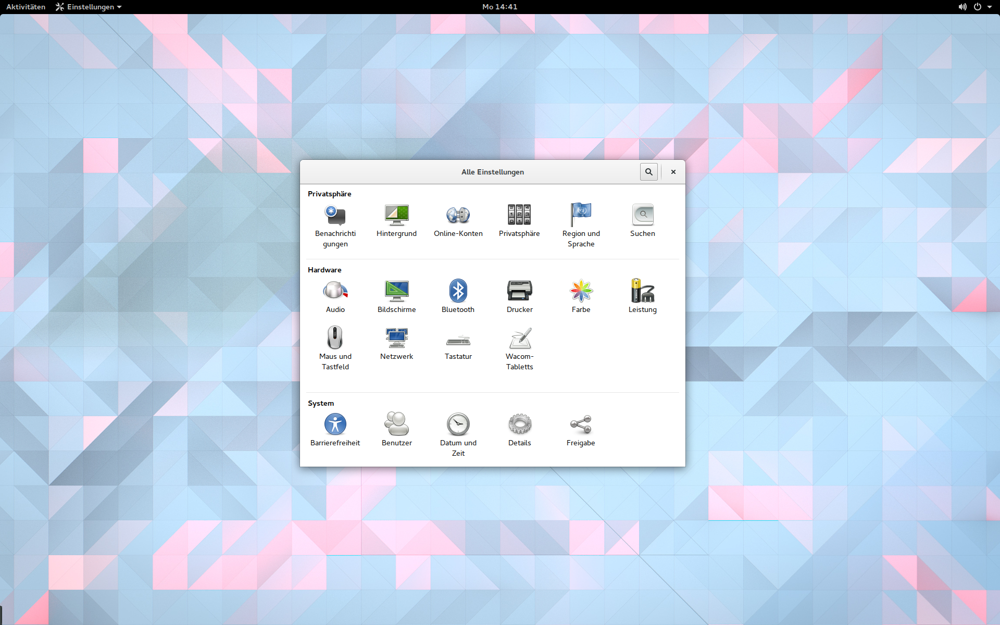
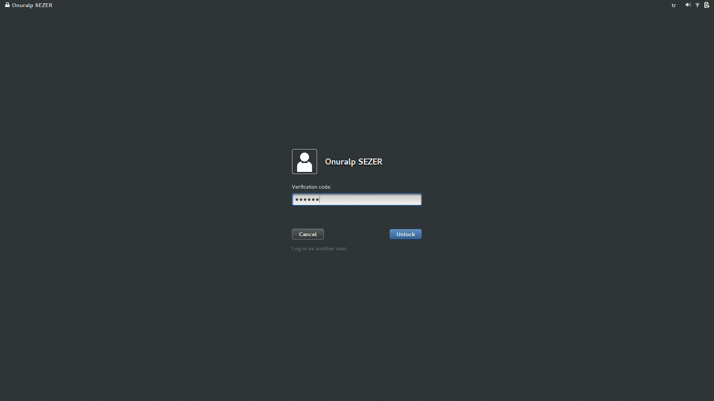
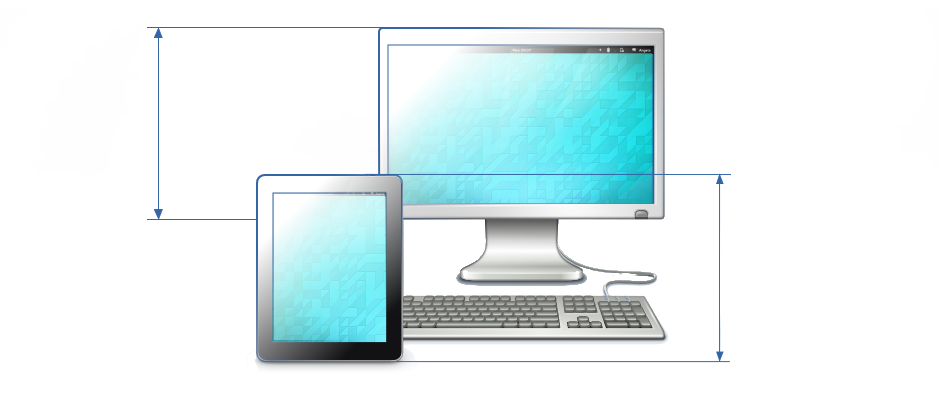
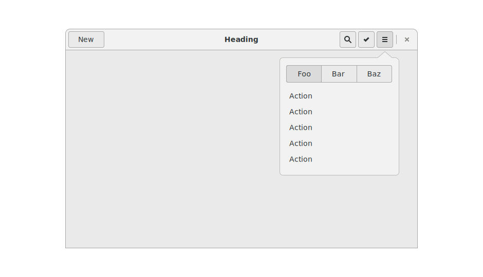
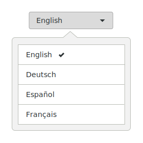
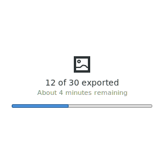
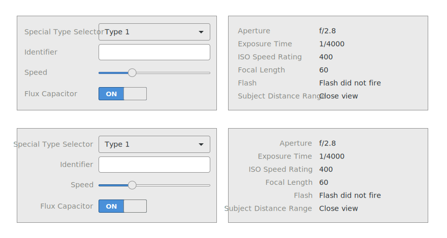

:title: gnome-hig
:author: Christopher Pahl
:description: Gnome HIG usability blurb
:keywords: presentation
:css: presentation.css

.. Ideen:
.. 
.. https://www.youtube.com/watch?v=xu0VSKvfNEI
.. https://xkcd.com/1172/

----

.. role:: underline
    :class: underline

.. role:: blocky
   :class: blocky

.. role:: tiny
   :class: tiny

:id: first 

.. note::

    Mein Name ist Christopher Pahl, Master Student.

    Vlt. hat der ein oder andere ja schon das logo mal gesehen.

Die Gnome HIG
:tiny:`kurz für [Human Interface Guidelines] ↗`

.. image:: images/gnome-grey.png
   :align: right

----

:blocky:`Was Gnome ist:`

- Eine Desktopumgebung. (ja, *eine*)
- Eine Entwicklerplattform.
- Eine Gemeinschaft.

------

:blocky:`Umfrage`

.. note::

    Hand heben geht so...

Wer hat *GNOME* schonmal genutzt?

Wer nutzt *GNOME* derzeit?

Wer kennt es immerhin?

------

:blocky:`Allgemeines`

.. note:

   100 Programme = 30 core, 70 andere + viele inofizielle.

   LGPL = libraries. Aber das nur am Rande.

- Born in **1999**.
- ~100 Programme für alltägliche Arbeiten.
- ``LGPL/GPLv3`` lizensiert; komplett Open Source.
- Aktuell Version ``3.18``

|

.. image:: images/applogos/gimp.png
   :width: 17%
   :align: center

.. image:: images/applogos/nautilus.png
   :align: center

           
.. image:: images/applogos/rythm.png
   :align: right

.. image:: images/applogos/devhelp.png
   :align: left

.. image:: images/applogos/glade.png
   :align: center

------

:blocky:`Ziele von GNOME`

.. image:: images/dilbert.gif
   :width: 70%
   :align: center

.. note::

    Recht generische Ziele.

    Der wievielte bin ich eigentlich der den Dilbert comic hier hat?

    Barrierfrei = screen reader, black/white, magnifier.

- Einfach und auch mobil benutzbar.
- Minimales, konsistentes Design.
- Internationalisiert und barrierefrei.
- Regelmäßige Veröffentlichungen mit Support.

------

:blocky:`Kurze Desktop Demo`

.. note::

    - Ausloggen/Einloggen.
    - Activities
    - Nautilus
    - Videos
    - Settings
    - Browser mit HIG

------

:blocky:`Usability`

Was hat das jetzt mit Usability zu tun?

* Ein ganzen Desktop ähnlich zu designen ist schwierig.
* Besonders wenn es behindertengerecht nutzbar sein muss.
* Besonders wenn es effizient benutzbar sein muss.
* Besonders wenn es internationalisiert sein muss.
* Besonders wenn es **gut** aussehen soll. 

:tiny:`(aaaaah!)`

.. image:: images/usab.png
   :align: center
   :width: 70% 

------

:blocky:`Der HIG`

``HIG`` = *Human Interface Guidelines*

**Aufgeteilt in 5 Gebiete:**

.. note:: 

    Von allgemein zu konkret.

- Prinzipien - **Allgemine Paradigmen**
- Patterns - **Konkrete Vorgehen**
- Elemente - **Konkrete Widgets**
- Guidelines - **Tipps & Tricks**
- Resourcen - **Icons und Fonts**

------

:blocky:`Prinzipien`

.. note::

    Interruptions = dialoge, nachfragen. (Suggested actions)

    Humour = Finanzanwendungen.

    Minimale = weniger fehler, weniger möglichkeit zur fehlbenutzung.

    Das hat den gnome leuten auch kritik eingebracht.

    Die ganzen Kategorieren werden auch immer konkreter.

Allgemeine Paradigmen und nicht-konkrete Designgedanken.

**Beispiele:**

    *Avoid interruptions.*

    *Use emotion and humor (sparingly)*

    *Keep user interface complexity to a minimum.*

------

:blocky:`Patterns`

Designstrategien bestehend aus konkreten Elementen.

**Beispiel:** ``Headerbar``

------

**Beispiel:** ``Actionbar``

.. image:: images/actionbar.svg
   :align: center

------

:blocky:`Elemente`

Einzelne Widgets oder Gruppen: 

.. image:: images/buttons.svg
   :width: 33%
   :align: left

------

:blocky:`Guidelines`

**Guidelines für:**

.. note::

    Artworks = Logo design. Was zu beachten gilt.

    Touch Gestures = Pinch bewegung zum zoomen.

- Typographie (1024×768 vs. 1024x768)
- Icons and Artworks.
- Touch Gestures. (``pinch == zoom``)
- …

------

:blocky:`Resourcen`

**Tango** icons und der *Cantarell* Font:

.. image:: images/tango.png
   :width: 50%

.. image:: images/cantarell.png
   :width: 50%

Icons aussuchen:

.. code-block:: bash

   $ gtk3-icon-browser

------

.. image:: images/shredder.png
   :width: 50%
   :align: right

:blocky:`Shredder`

- Ein Duplikatfinder für Unix.
- Basierend auf ``rmlint``.
- Frontend für einen Duplikatfinder in ``GTK+``.
- Größtenteils nach Gnome Richtlinen gestaltet.

------

.. image:: images/shredder_screen.png
   :width: 100%
   :align: center

------

:blocky:`Eine kleine Aufgabe...`

Finde und lösche alle Duplikate ≥ 5 MB im ``/tmp`` Ordner.

.. code-block:: bash

    $ sudo pacman -S rmlint-shredder

-------

:blocky:`Verbesserungsvorschlaege`

.. image:: images/little_britain.png
   :align: center
   :width: 90%

-------

:id: fin

.. note::

    Warum erzähl ich euch das jetzt alles?

    Nützlich für andere Projekte.

    Gnome HIG ist nur einer von vielen.

    GTK+, GLib

:blocky:`Letzte Worte`

Richtlinien nicht nur für GNOME Anwendungen nützlich:

    https://developer.gnome.org

    https://developer.gnome.org/hig/stable

|

**(Fragen?)**
