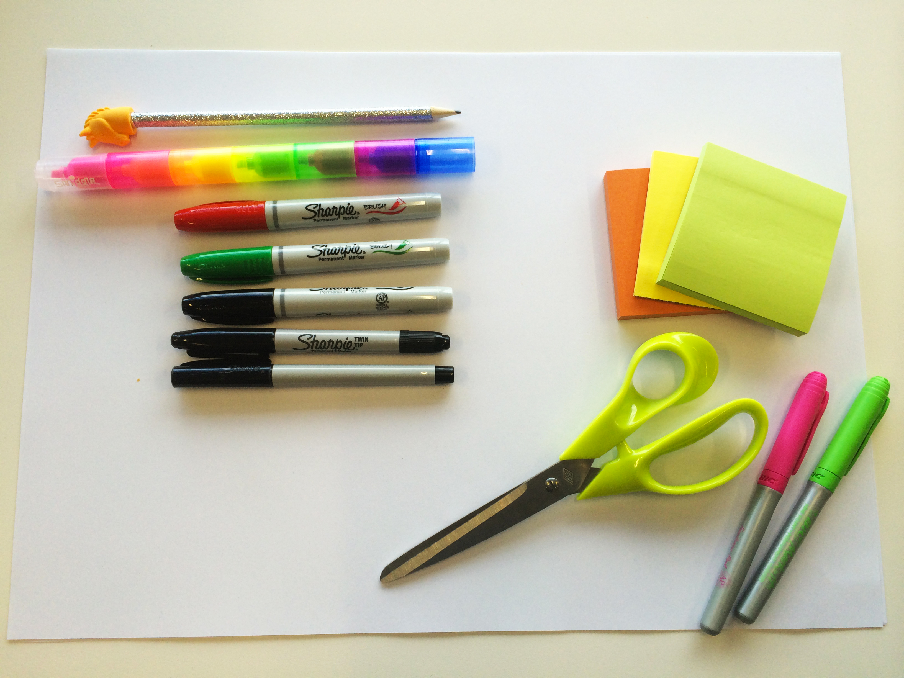
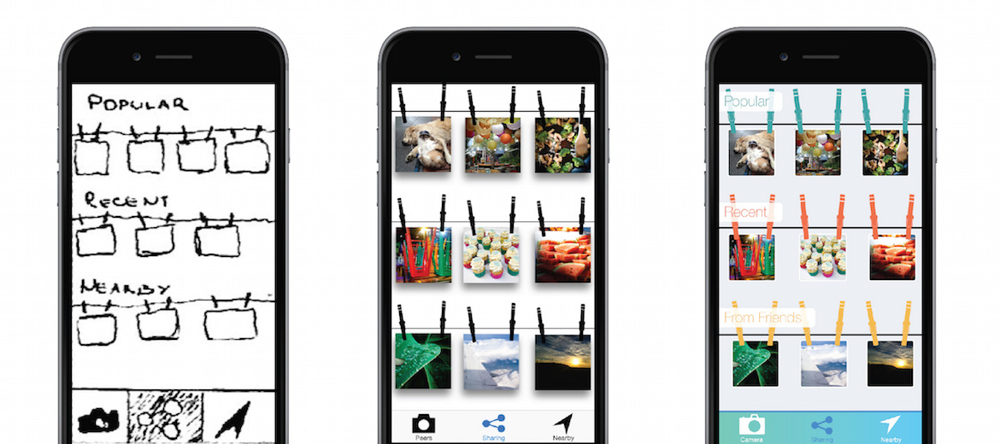
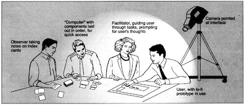
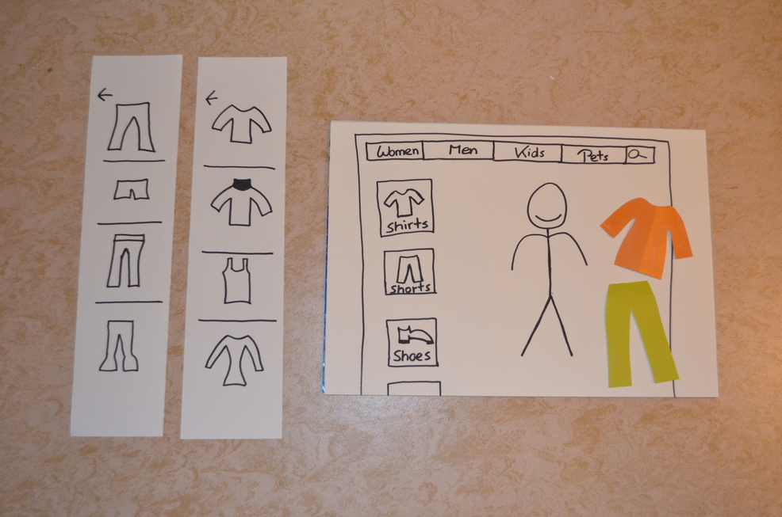
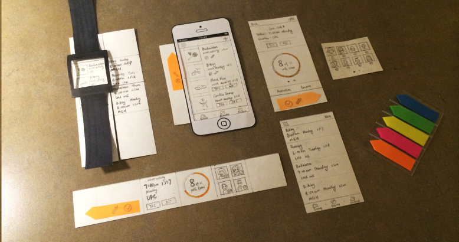
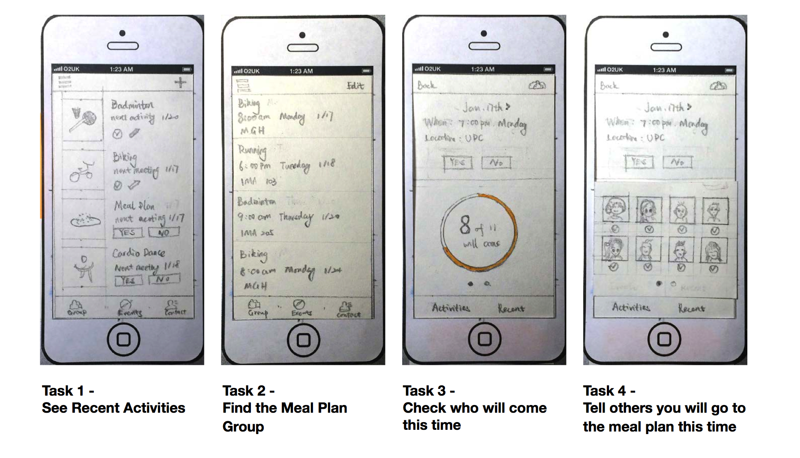
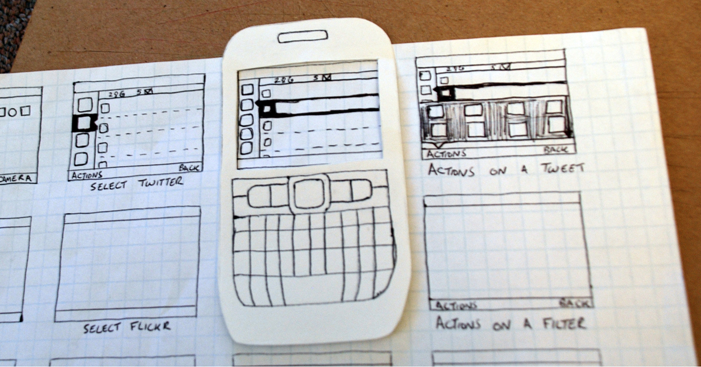
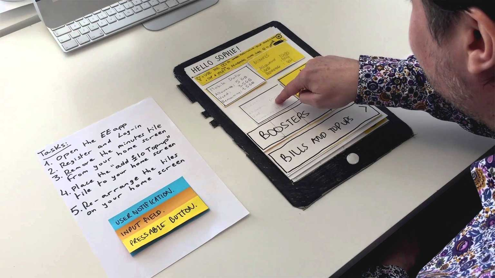
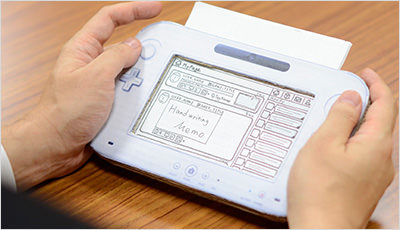
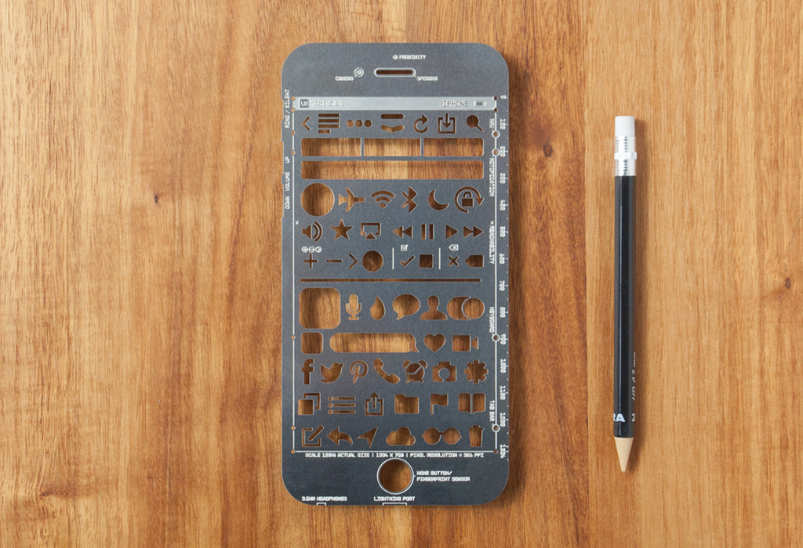

:title: paper prototyping
:author: Susanne Kießling
:description: The Hovercraft! tutorial.
:keywords: presentation, backend, impress.js, hovercraft, usability eng
:css: presentation.css

----

.. utility roles

.. role:: underline
   :class: underline

.. role:: blocky
   :class: blocky

.. role:: tiny
   :class: tiny

.. role:: blocky2
   :class: blocky2

.. role:: paperproto
   :class: paperproto

:id: first           

 .. image:: images/title.png
   :align: center
   :height: 700px

.. note::

   - Thema: Usability-Tests anhand von Paper Prototyping

----

:blocky:`Prototyp`

.. note::
   - Das erste Bild, das man sich vom Produkt macht

griechisch **protos** „der Erste“  und **typos** „Urbild, Vorbild“

- Sammeln von Informationen, Ideen
- Fehler erkennen und beheben
- Überarbeitung von Anforderungen, Spezifikationen
- Kommunikation im Team steigern
- Funktions-Test, Usability-Test ...

-------

:blocky:`Paper Prototyping`

.. note::
   - wenig Ausrüstung notwendig

+ Medium: Papier
+ Ausrüstung: Stifte, Schere, Kleber, Haftzettel

+ Wird als Low-Fidelity Prototyp bezeichnet

-------

.. note::
   - Fidelity, Ähnlichkeit zum Endprodukt
   - in der Literatur ist auch häufig der Medium-Fidelity
     zu finden
   - zusätzl. Kenntnisse: Programmierkenntnisse, Designkenntnisse

**Frage: Wie ähnlich ist der Prototyp dem Endprodukt?**

+ Low-Fidelity Prototyp
   * Relativ weit entfernt vom Endprodukt
   * Schnell in der Erstellung
   * Lässt sich einfach abändern
+ High-Fidelity Prototyp
   * Relativ nah am Endprodukt
   * Aufwändiger in der Erstellung
   * Zusätzliche Kenntnisse erforderlich
   
----

:blocky2:`Fidelity-Dimensionen`

.. note::
   - Inhalt: gefüllt mit Lorem ipsum Text oder tatsächli. Text, Bilder

- Visuell (Skizze --- Fertiges Design)
- Funktionell (statisch --- interaktiv)
- Inhaltliche Vollständigkeit (Dummy Inhalt --- tatsächlicher Inhalt)

----

:blocky:`Testvorbereitung`

.. note::
   - Wie bei anderen Prototypen, die auf Usability getestet werden
   - Ziel: was wird erwartet

- Testpersonen auswählen
- Ziel des Tests festlegen
- Welche Teile der Software sollen verwendet werden
- Methode festlegen: Aufgabentest, Thinking Aloud
- Liste mit Aufgaben erstellen, die vom Test-Benutzer zu lösen sind
- Ablauf festlegen

----

:blocky:`Testablauf`

+ Testperson erhält Einführung 
+ Aufgabe wird erklärt
+ Moderator führt durch den Test
+ Weitere Person übernimmt die Aufgabe des Computers
+ Beobachter macht Notizen

.. note::
   - Ausführlichkeit der Einführung und Aufgabenerklärung je nach
     beabsichtiger Aufgabe, Ziel des Tests

------

:blocky:`Besonders geeignet für`

+ Zielgruppen, die mit dem jeweiligen Medium nicht vertraut sind
+ Neuartiges, wofür es noch keine vorgefertigten Design-Elemente gibt
+ Klärung der Fragen:
   * Funktioniert Konzept grundsätzlich?
   * Navigation: Hat der Benutzer das Ergebnis erwartet?

.. note::   
  - Zielgruppen: Kinder, ältere Menschen
    Medium soll nicht von eigentlicher Usability ablenken
  - wird Konzept überhaupt verstanden
  - wie ist der erste Eindruck

------

:blocky:`Paper Prototype Demo`

.. note::   
    - Webseite, App für die ganze Familie: Kleidung

    
------

:blocky:`Game Prototyp`

.. note::   
    - Für Videospiele wird häufig ein Papier Prototyp erstellt  
    - Regeln und Abläufe können getestet werden
    - Grafik sehr aufwändig, Paper Prototyp ermöglich rasche Skizzen
    - Elemente sind schnell austauschbar, veränderbar

.. image:: images/papergame.jpg
   :align: right
   :height: 400px

-------
            
:blocky:`GACT Project`

.. note::   
   - Mehrere Gruppen möglich
   - Es können alle aktuellen Aktivitäten an denen teilgenommen wird, angezeigt
     werden

- App für gemeinsame Unternehmungen in der Gruppe
- Entworfen für Smartphone und Smartwatch
- Teilnehmer geben bekannt, wann sie zu welcher
  Unternehmung teilnehmen

-------

:blocky:`GACT Project`

.. note::   
   - jfjfj

------

:blocky:`Dummy Gerät`

.. note::   
   - There are 2 slots which can be configured 
      

------

:blocky:`Aufgabentest`

.. note::   
   - Hier ist zu sehen, wie Test-Nutzer Aufgaben erledigt 

------

:blocky:`Nintendo`

.. note::   
   - Entwicklung von Miiverse für Wii U, Netzwerk um mit anderen Spielern in
     Kontakt zu treten
   - Externe Firma wurde für Design beauftragt
   - Wii U Gamepad war noch nicht fertiggestellt, oder für beauftragte Firma
     nicht verfügbar
   - Um das Gefühl davon zu bekommen, wie es zusammen mit Gamepad wirkt,
     Prototyp aus Papier erstellt

------

:blocky:`Videoaufnahme, Usability-Test mit PP`

+ Selbstbedienungs-Automat für Bluttest
+ 3 Bluttests stehen zur Auswahl
+ Zahlmethode: Kreditkarte, EC-Karte, Bargeld
+ Ergebnisse des Tests werden ausgedruckt

.. note::
  - Benutzer kann zwischen 3 verschiedenen Bluttests wählen:
    Schwangerschaftstest, Blutanalyse(Blutbild), STD
    sexuell übertragbare Krankheiten (sexually transmitted diseases)
  - Zahlmethode: Kreditkarte, Bargeld
  - Nachdem der Bluttest erfolgreich abgeschlossen wurde, bekommt
    der Benutzer einen Bericht ausgedruckt
  - Paper Prototype um vorerst das Konzept zu testen

------

:blocky:`Zubehör -- Schablone`

.. note::
  - Schablone für Icons und häufig verwendete Sachen

   
------

:blocky:`Zubehör -- Vorlagen`

.. note::
  - Vorgefertigte Vorlagen für z.B. Smartphone

.. image:: images/vorlage.jpg
   :align: right
   :height: 400px
 
------

:blocky:`Warum PP?`

+ Kostengünstig
+ Schnell änderbar
+ Testpersonen sind mit Kritik weniger zurückhaltend
+ Änderungen werden bereitwilliger umgesetzt, da noch nicht
  enorm viel Arbeit reingesteckt wurde
+ Personenkreis der am Prototyp mitwirken kann ist groß
  d.h. unterschiedliche Disziplinen können zusammenarbeiten
+ lt. verschiedenen Studien im Vergleich zu High-Fidelity Prototypen
  kein signifikanter Unterschied in der Erkennung von Fehlern

.. note::
  - Personenkreis groß weil: keine Programmierkenntnisse notwendig,
    oder sonstige Software, die benutzt werden muss

------

:blocky:`Einschränkungen`

+ Weniger geeignet für Interaktionen
+ Oder Umsetzung aller Funktionalitäten
+ Blätter müssen gewechselt, aufgelegt werden
+ Für die Präsentation des Produkts ist irgendwann
  ein High-Fidelity Prototyp sinnvoll

.. note::
  - Blätter: Ordnung muss gehalten werden auf Aktionen der
    Testperson reagiert werden
  - Präsentation: Für Marketingzwecke etc. ein High-Fidelity 
    Prototyp früher oder später sinnvoll

---------------------

:blocky:`Fazit`
  
    Usability-Tests mit Paper Prototyping durchzuführen, ist eine
    interessante Alternative zu bestehenden digitalen Lösungen.

---------------------

:tiny:`Vielen Dank für Ihre Aufmerksamkeit`

