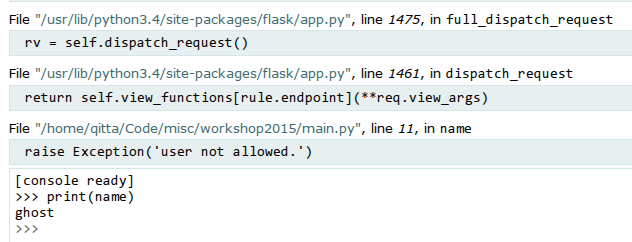

:title: Flask
:author: Christoph Piechula
:description: The Hovercraft! tutorial.
:keywords: presentation, backend, impress.js, go-lang
:data-transition-duration: 500
:css: presentation.css 

----

:id: first

**10 Minutes** Introduction to
==============================

.. image:: images/flask.png
    :width: 50%

.. note:: 
    * Welcome everbody
    * Today we want to find out if Flask might be suitable 
      for our paper deployment plattform

----

:id: details 

What is **Flask**?
==================

* A microwebframework written in Python
* Started as a April Fool's joke in 2010
* Developed by Armin Ronacher
* Open Source (BSD License)

.. note::
    * Open Source Project started by Armin Ronacher
    * Started as Project Denied (Aprils fool joke)
    * Just about 2500 lines of code

----

What does this **micro** mean? #1
=================================

:: 

    The idea of Flask is to build a good foundation for all 
    applications. Everything else is up to you or extensions.  
                                           -- Armin Ronacher

* Based on Werkzeug WSGI toolkit 
* Uses Jinja 2 template engine
* Aims to extensible and well documented

.. image:: images/jinja2.png
    :width: 20%

.. note: depends only on jinja 2 and werkzeug

.. note::
    * Flask only depends on Jinja2 and Werkzeug
    * Werkzeug is a WSGI middleware acts between
      the Python application and the webserver

----

:id: puzzle

What does this **micro** mean? #2
=================================

* Flask keeps the core simple but extensible

  + No form validation
  + Has no database abstraction layer
  + no user management
  + ...

* Add features yourself by using extensions

  + Flask-WTF
  + Flask-SQLAlchemy 
  + Flask-Cache
  + ...

  
.. note:: 
    * Django has a lot of stuff included
    * Large Frameworks like Django are often overkill for small projekts
    * Flask just provides a simple core

    * Its up to the user what should be included
      + One Drop at a time philosophy -> Install just what you need
    * Extensible by using extensions and plugins

----

Flask Hello World
=================

Creating a page with less code.

.. code:: python

    from flask import Flask
    app = Flask('myapp')

    @app.route("/", methods=['GET'])
    def index_page():
        return "Hello Flask!"

    if __name__ == "__main__":
        app.run()

.. code:: bash

    $ curl -i localhost:5000
    HTTP/1.0 200 OK
    Content-Type: text/html; charset=utf-8
    Content-Length: 11
    Server: Werkzeug/0.10.4 Python/2.7.8
    Date: Wed, 15 Apr 2015 17:46:07 GMT

    Hello Flask

.. note::
    * Route is mapped directly to a function 
    * http methods, GET default
    * Curl webresource retrival client -> just TEXT output, not html!

----

Templating Engine
=================

* Jinja 2 is the default templating engine

    + Supports template inheritance
    + Fast and flexible development
    + Can be easily exchanged
    
* Can be combined with Bootstrap using Flask-Bootstrap
  
.. note:: 
   * You have to care about proper html excaping
     to keep your application secure
   * DRY philosopy -> Inheritance

----

Jinja 2 Hello World
===================

* Jinja 2 template (templates/greet.html):

.. code:: html

    <!doctype html>
    <title>Hello from Flask</title>
    
        <h1>
        {{ name.capitalize() }}, watch out for ghosts! ᗧ ••• ᗣ ••
        </h1>
    
        <h1>Hello {{ name }}!</h1>
    

* Flask application:

.. code:: python

    from flask import render_template

    @app.route('/greet/<name>')
        return render_template('greet.html', name=name)

.. note::
    * html, body, title missing i know
    * Jinja has different markers
    * Python code inside templates possible

----

Jinja 2 Hello World
===================

.. code:: python

    @app.route('/greet/<name>')
    def greet(name=None):
        return render_template('greet.html', name=name)

.. code:: bash

   $ curl -i localhost:5000/greet/pacman
   <!doctype html>
   <title>Hello from Flask</title>
    
       <h1>Pacman, watch out for ghosts! ᗧ ••• ᗣ •• </h1>

.. code:: bash

   $ curl -i localhost:5000/greet/batman
   <!doctype html>
   <title>Hello from Flask</title>
    
           <h1>I am batman!</h1>

.. note::
    * Different names -> different results

----

:id: security

Security
========

.. image:: images/helmet.png
    :width: 20%

* Flask-Security (extension)

  + Session based authentication
  + Role management
  + Password encryption
  + Token based authentication
  + User registration 
  + [...]

* Jinja 2 proper HTML escaping to prevent XSS
* KISS principle, less bug prone

.. note:: 
    * Security by using extension
    * Jinja2 enhanced security -> unix philosophy
    * KISS principle -> less bugs prone

----

:id: ide

Python IDE's and Editors
========================

Yes there are IDE's and Plugins!

* Eric
* PyCharm
* PyDev
* ...

.. image:: images/emacsvim.png
    :width: 30%

But,... Python developers often prefer to use simple text editors like **vim** or
**emacs**.

.. note::
    * You are not forced to use a IDE like eclipse
    * This is not always the case when working with other frameworks, like Java
      GWT/Dart

----

Webserver included
==================

.. code:: python

   if __name__ == '__main__':
       app.run(host='localhost', port='4242')

* Integrated development server 
* Running on http://localhost:4242

.. code:: bash

    $ python main.py
    * Running on http://127.0.0.1:4242/ (Press CTRL+C to quit)
    * Restarting with stat

.. note:: 
    * Testwebserver provided by Werkzeug

----

Debugger included
=================

* Integrated debugger console
* Directly integrated at http://localhost:4242

.. code:: python

    @app.route('/<name>')
    def name(name):
        if name == 'ghost':
            raise Exception('user not allowed.')
        else:
            return 'Hello {name}'.format(name=name)

.. code:: bash
    
   $ curl localhost:5000/ghost
   <!DOCTYPE HTML PUBLIC "-//W3C//DTD HTML 4.01 Transitional//EN"
     "http://www.w3.org/TR/html4/loose.dtd">
   <html>
     <head>
       <title>Exception: user not allowed. // Werkzeug Debugger</title>
       <link rel="stylesheet" href="?__debugger__=yes&amp;cmd=resour..."
    [...]

.. note::
    * If a exeption occurs, a interactive shell appears in your browser

----

Debugger included
=================

.. code:: bash
    
   $ curl localhost:5000/ghost

----

Unit Testing included
=====================
 
* Integrated unit testing support
* Werkzeug test client

.. code:: python

   import unittest

   class TestCase(unittest.TestCase):

       def setUp(self):
           app.config['TESTING'] = True
           db.init_db()

       def tearDown(self):
           db.cleanup()

       def test_case_xy(self):
           assert app.value == 'my expected value'

   if __name__ == '__main__':
       unittest.main()

.. note:: 
    * Unittests like in usual Python + there is a werkzeug test client

----

Let's sum up!
=============

* **Pros**:

* Flask:

  + Maximum flexibility by using extensions (Flask)
  + Powerful templating engine (Jinja 2)
  + Debugger and webserver/client included (Werkzeug)
  + Support for Google App Engine and Heroku
  + Security 

* Python

  + Batteries included (Python)
  + Python is widely used among researchers
  
* You are free to choose your development environment
* Complexity is stripped down to a minimum

.. note::
    * Python and Flask may be used with IPython Notebook

----

Let's sum up!
=============

* **Cons**:

  + Not as popular as Django
  + Synchronous framework by nature
  + No websockets included
  + ,,Slow" interpreted language

.. note::

    Critical parts may be exchanged with Cython/C
    There is socketio, autobahn, tornado to implement async behaviour

----

Thank you for your attention!
=============================

* Flask resources:

    * Flask: http://flask.pocoo.org/
    * Extensions:  http://flask.pocoo.org/extensions/
    * Jinja 2: http://jinja.pocoo.org/
    * Werkzeug: http://werkzeug.pocoo.org/

* Pocoo Team is an international group of enthusiasts from the Python community.
